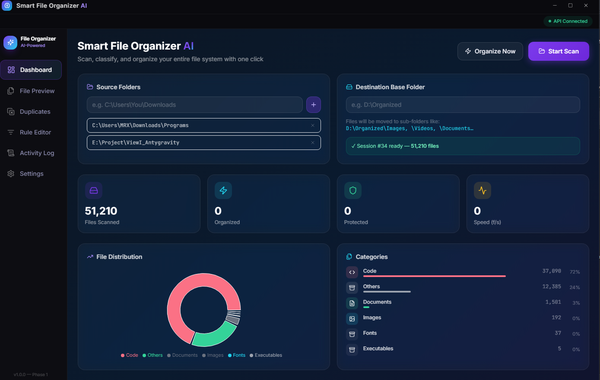
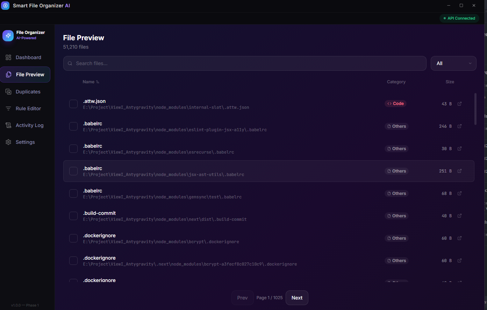
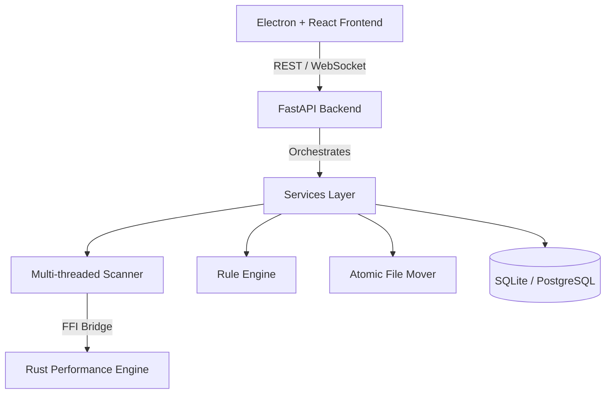

# 📂 Smart File Organizer AI

[](https://opensource.org/licenses/MIT)
[](https://www.python.org/downloads/)
[](https://nodejs.org/)
[](https://www.rust-lang.org/)

> **The ultimate file management companion.** An autonomous, cross-platform desktop application that scans, classifies, and organizes your entire file system with surgical precision. Powered by a high-performance Python + Rust engine and a stunning Electron + React frontend.

---

## 📸 Screenshots

| Dashboard View | File Preview & Analysis |
| :---: | :---: |
|  |  |

---

## ✨ Premium Features

- **🔍 Hyper-Fast Scanning**: Multi-threaded engine using `os.scandir()` and Rust-powered walkers. Up to 5x faster than standard tools.
- **🧠 Intelligent Classification**: Rule-based engine (extensions, regex, globs) with AI-ready hooks for future semantic organization.
- **🛡️ Safety First**: 
  - **Dry-Run Mode**: See exactly what will happen before a single file is moved.
  - **Atomic Operations**: Same-drive renames and verified cross-drive copies.
  - **System Protection**: Hardcoded guards prevent modification of critical OS directories.
- **↩️ Universal Undo**: Every operation is logged. Regret a move? Revert it with one click.
- **🔁 Duplicate Detection**: 3-stage verification (Size → Partial Hash → XXHash64) ensures 100% accuracy with zero overhead.
- **📊 Real-Time Analytics**: Beautiful dashboard with file distribution charts and live progress via WebSockets.
- **⚡ Rust Core**: Critical paths implemented in Rust via PyO3 for maximum performance.

---

## 🏗️ Architecture



---

## 🚀 Quick Start

### 1. Backend Setup
```powershell
# Setup virtual environment
python -m venv .venv
.\.venv\Scripts\Activate.ps1

# Install dependencies
pip install -r backend/requirements.txt

# Launch FastAPI
python -m uvicorn backend.main:app --host 127.0.0.1 --port 8765 --reload
```

### 2. Frontend Setup
```powershell
cd frontend
npm install
npm run dev
```

---

## 📁 Project Structure

| Directory | Description |
| :--- | :--- |
| `backend/` | FastAPI server, business logic, and database models. |
| `frontend/` | React dashboard, Electron main process, and state management. |
| `rust_engine/` | High-performance Rust modules for scanning and hashing. |
| `scripts/` | Automation scripts for development and building. |
| `tests/` | Comprehensive pytest suite for all core components. |

---

## 🧪 Safety & Integrity

The **Smart File Organizer AI** is built with a "Zero-Destruction" philosophy:
1. **No Deletions**: Files are only moved or copied.
2. **Collision Prevention**: Automatically handles name conflicts (e.g., `report.pdf` → `report_(1).pdf`).
3. **Verified Copies**: When moving across drives, we verify the file hash before deleting the source.
4. **Log Everything**: A persistent history of every action taken.

---

## 🗺️ Roadmap

- [x] Phase 1-5: Core Engine, UI, and WebSocket Progress.
- [x] Phase 6: Rust FFI Integration.
- [ ] **Phase 7**: Windows NSIS Installer & Auto-updates.
- [ ] **Phase 8**: NLP-based smart file naming (AI Model Integration).
- [ ] **Phase 9**: Cloud Sync & Multi-machine support.

---

## 📄 License

This project is licensed under the MIT License - see the [LICENSE](LICENSE) file for details.

---

<p align="center">
  Developed with ❤️ by the Smart File Organizer Team
</p>
